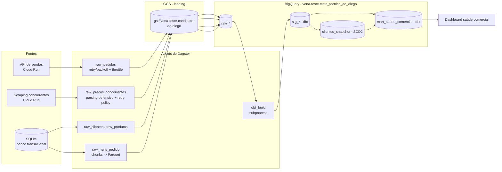

# Arquitetura

## Visão geral do fluxo

Grafo real no Dagster: os 5 assets de ingestão (`raw_clientes`,
`raw_produtos`, `raw_itens_pedido`, `raw_pedidos`,
`raw_precos_concorrentes`) alimentam a raw no BigQuery; `dbt_build`
depende de todos os 5 (dependência real, não só ordem) e roda staging →
snapshot → mart + testes num único `dbt build`.

## Decisões de arquitetura

- **dbt para staging/mart em vez de SQL solto orquestrado direto no
  Dagster**: dedup, tipagem, SCD2 (snapshot) e testes de qualidade
  nativos, com lineage explícito. O Dagster orquestra o `dbt build` como
  um único asset (`subprocess`, não `@dbt_assets` — ver
  `dagster_defs/resources.py` pro motivo), preservando a dependência
  real entre ingestão e transformação no grafo.
- **Parquet particionado em GCS antes do load para o BigQuery raw** (não
  INSERT linha a linha): evita materializar `itens_pedido` (5M linhas)
  inteiro em memória e permite load com `WRITE_TRUNCATE` (idempotente —
  ver seção de idempotência no README).
- **Retry/backoff via `tenacity` na API + throttle proativo entre
  páginas**, e parsing por padrão de texto (não seletor CSS) no
  scraping: as duas fontes têm falhas propositais (rate limit/500
  intermitente e schema drift) — validado que ambas realmente acontecem
  contra o ambiente real do desafio, não só simuladas em teste.
- **Join point-in-time no mart** (`mart_saude_comercial` ×
  `clientes_snapshot`, via `data_item` contra `dbt_valid_from`/
  `dbt_valid_to`): resolve o cliente de cada venda pelo estado que ele
  tinha *na época*, não o atual — o motivo de existir o SCD2. Achado e
  corrigido um bug real aqui (ver README, seção "Bug real encontrado
  após a etapa 4") onde a condição estrita zerava 100% das linhas por
  causa de vendas retroativas anteriores ao início do rastreamento.
- **Idempotência de ponta a ponta**: `WRITE_TRUNCATE` na raw + `dbt
  build` recalculando staging/mart do zero a cada execução + snapshot
  SCD2 com `strategy=check` (só versiona quando o dado de fato muda).
  Validado rodando o pipeline completo duas vezes seguidas e comparando
  contagens de linha (ver README).

Decisões específicas de cada etapa (SQLite, API, scraping, dbt, Dagster)
estão documentadas em maior detalhe no `README.md`, junto com os bugs
reais encontrados e como foram corrigidos.
