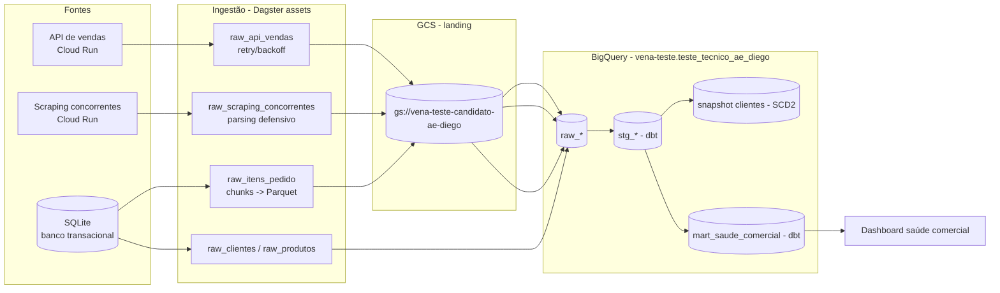

# Arquitetura

## Visão geral do fluxo

## Decisões de arquitetura (a documentar conforme o projeto avança)

- **Por que dbt para staging/mart em vez de SQL solto orquestrado direto no
  Dagster:** dedup, tipagem, SCD2 (snapshot) e testes de qualidade nativos,
  com lineage explícito. O Dagster orquestra o `dbt build` como um asset,
  preservando as dependências reais entre camadas no grafo.
- **Por que Parquet particionado em GCS antes do load para o BigQuery raw
  (e não INSERT linha a linha):** evita materializar `itens_pedido`
  (5M linhas) inteiro em memória e permite load incremental/idempotente.
- **Por que retry/backoff via `tenacity` na API e parsing defensivo por
  registro no scraping:** as duas fontes têm falhas propositais (rate
  limit/500 intermitente e schema drift) — o pipeline não pode falhar por
  completo por causa de uma página ou request pontual.

> Seções de trade-offs específicos de cada etapa (ingestão do SQLite, API,
> scraping, modelagem dbt, orquestração Dagster) serão preenchidas conforme
> cada uma for implementada.
